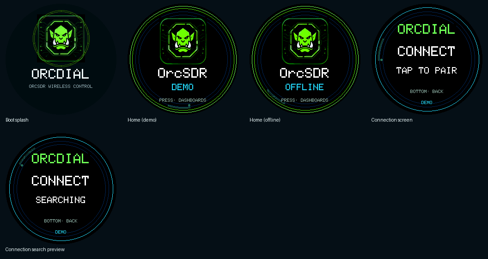
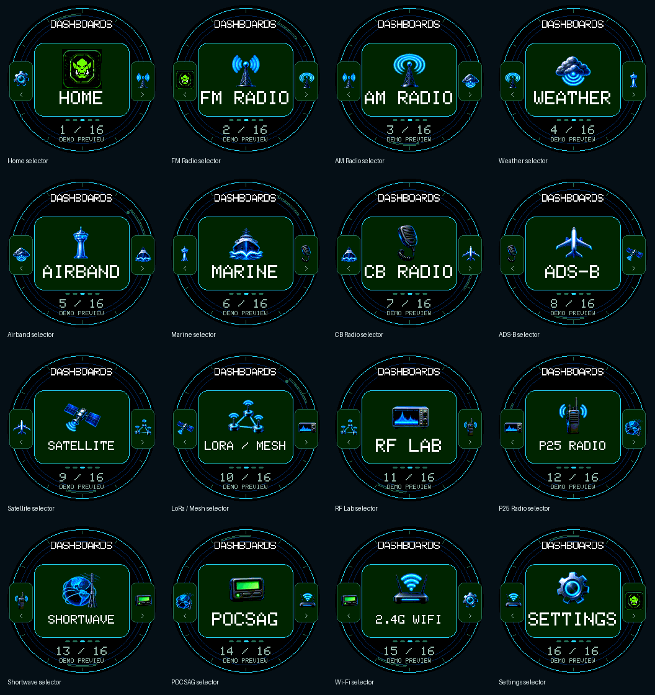
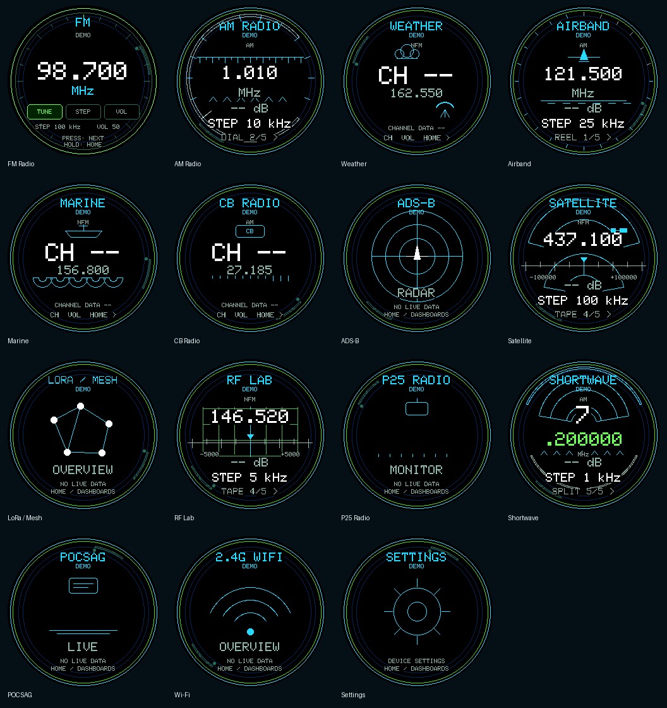
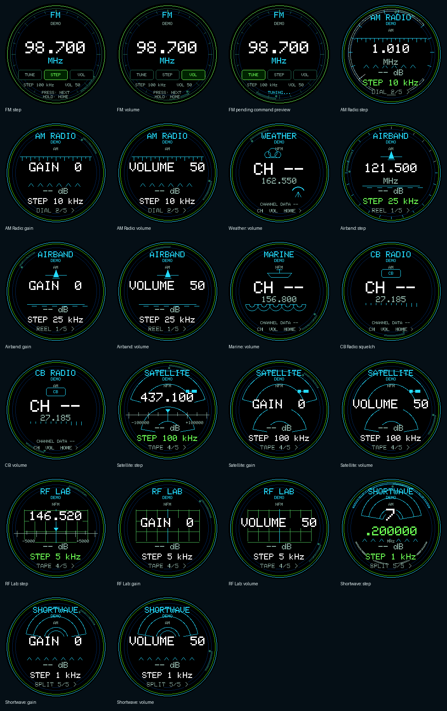
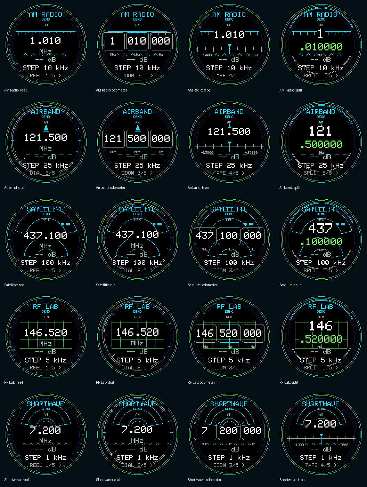
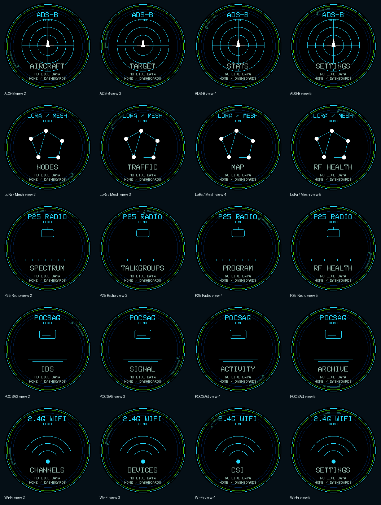

# OrcDial screen gallery

Captured from the M5Dial using the production UI renderer. These are documentation previews, not proof of live RF reception or implementation of every dashboard action. Boot and offline states retain their normal labels; other previews are marked DEMO. The connected/paired live status is not simulated.

Each image is 240 × 240. Transparent corners match the round display; `raw/` preserves unmasked framebuffer captures. The manifest records commands and hashes. Animation is captured as a single frame, not an animation recording.

## Primary

- [Boot splash](boot.png)
- [Home (demo)](home-demo.png)
- [Home (offline)](home-offline.png)
- [Connection screen](connection.png)
- [Connection search preview](connection-searching.png)

## Selectors

- [Home selector](selector-home.png)
- [FM Radio selector](selector-fm.png)
- [AM Radio selector](selector-am.png)
- [Weather selector](selector-weather.png)
- [Airband selector](selector-airband.png)
- [Marine selector](selector-marine.png)
- [CB Radio selector](selector-cb.png)
- [ADS-B selector](selector-adsb.png)
- [Satellite selector](selector-satellite.png)
- [LoRa / Mesh selector](selector-lora.png)
- [RF Lab selector](selector-rf-lab.png)
- [P25 Radio selector](selector-p25.png)
- [Shortwave selector](selector-shortwave.png)
- [POCSAG selector](selector-pocsag.png)
- [Wi-Fi selector](selector-wifi.png)
- [Settings selector](selector-settings.png)

## Dashboards

- [FM Radio](dashboard-fm.png)
- [AM Radio](dashboard-am.png)
- [Weather](dashboard-weather.png)
- [Airband](dashboard-airband.png)
- [Marine](dashboard-marine.png)
- [CB Radio](dashboard-cb.png)
- [ADS-B](dashboard-adsb.png)
- [Satellite](dashboard-satellite.png)
- [LoRa / Mesh](dashboard-lora.png)
- [RF Lab](dashboard-rf-lab.png)
- [P25 Radio](dashboard-p25.png)
- [Shortwave](dashboard-shortwave.png)
- [POCSAG](dashboard-pocsag.png)
- [Wi-Fi](dashboard-wifi.png)
- [Settings](dashboard-settings.png)

## Controls

- [FM: step](fm-focus-step.png)
- [FM: volume](fm-focus-volume.png)
- [FM pending command preview](fm-pending.png)
- [AM Radio: step](am-focus-step.png)
- [AM Radio: gain](am-focus-gain.png)
- [AM Radio: volume](am-focus-volume.png)
- [Weather: volume](weather-focus-volume.png)
- [Airband: step](airband-focus-step.png)
- [Airband: gain](airband-focus-gain.png)
- [Airband: volume](airband-focus-volume.png)
- [Marine: volume](marine-focus-volume.png)
- [CB Radio: squelch](cb-focus-squelch.png)
- [CB: volume](cb-focus-volume.png)
- [Satellite: step](satellite-focus-step.png)
- [Satellite: gain](satellite-focus-gain.png)
- [Satellite: volume](satellite-focus-volume.png)
- [RF Lab: step](rf-lab-focus-step.png)
- [RF Lab: gain](rf-lab-focus-gain.png)
- [RF Lab: volume](rf-lab-focus-volume.png)
- [Shortwave: step](shortwave-focus-step.png)
- [Shortwave: gain](shortwave-focus-gain.png)
- [Shortwave: volume](shortwave-focus-volume.png)

## Tuning Styles

- [AM Radio: reel](am-style-reel.png)
- [AM Radio: odometer](am-style-odometer.png)
- [AM Radio: tape](am-style-tape.png)
- [AM Radio: split](am-style-split.png)
- [Airband: dial](airband-style-dial.png)
- [Airband: odometer](airband-style-odometer.png)
- [Airband: tape](airband-style-tape.png)
- [Airband: split](airband-style-split.png)
- [Satellite: reel](satellite-style-reel.png)
- [Satellite: dial](satellite-style-dial.png)
- [Satellite: odometer](satellite-style-odometer.png)
- [Satellite: split](satellite-style-split.png)
- [RF Lab: reel](rf-lab-style-reel.png)
- [RF Lab: dial](rf-lab-style-dial.png)
- [RF Lab: odometer](rf-lab-style-odometer.png)
- [RF Lab: split](rf-lab-style-split.png)
- [Shortwave: reel](shortwave-style-reel.png)
- [Shortwave: dial](shortwave-style-dial.png)
- [Shortwave: odometer](shortwave-style-odometer.png)
- [Shortwave: tape](shortwave-style-tape.png)

## Content Views

- [ADS-B view 2](adsb-view-1.png)
- [ADS-B view 3](adsb-view-2.png)
- [ADS-B view 4](adsb-view-3.png)
- [ADS-B view 5](adsb-view-4.png)
- [LoRa / Mesh view 2](lora-view-1.png)
- [LoRa / Mesh view 3](lora-view-2.png)
- [LoRa / Mesh view 4](lora-view-3.png)
- [LoRa / Mesh view 5](lora-view-4.png)
- [P25 Radio view 2](p25-view-1.png)
- [P25 Radio view 3](p25-view-2.png)
- [P25 Radio view 4](p25-view-3.png)
- [P25 Radio view 5](p25-view-4.png)
- [POCSAG view 2](pocsag-view-1.png)
- [POCSAG view 3](pocsag-view-2.png)
- [POCSAG view 4](pocsag-view-3.png)
- [POCSAG view 5](pocsag-view-4.png)
- [Wi-Fi view 2](wifi-view-1.png)
- [Wi-Fi view 3](wifi-view-2.png)
- [Wi-Fi view 4](wifi-view-3.png)
- [Wi-Fi view 5](wifi-view-4.png)
