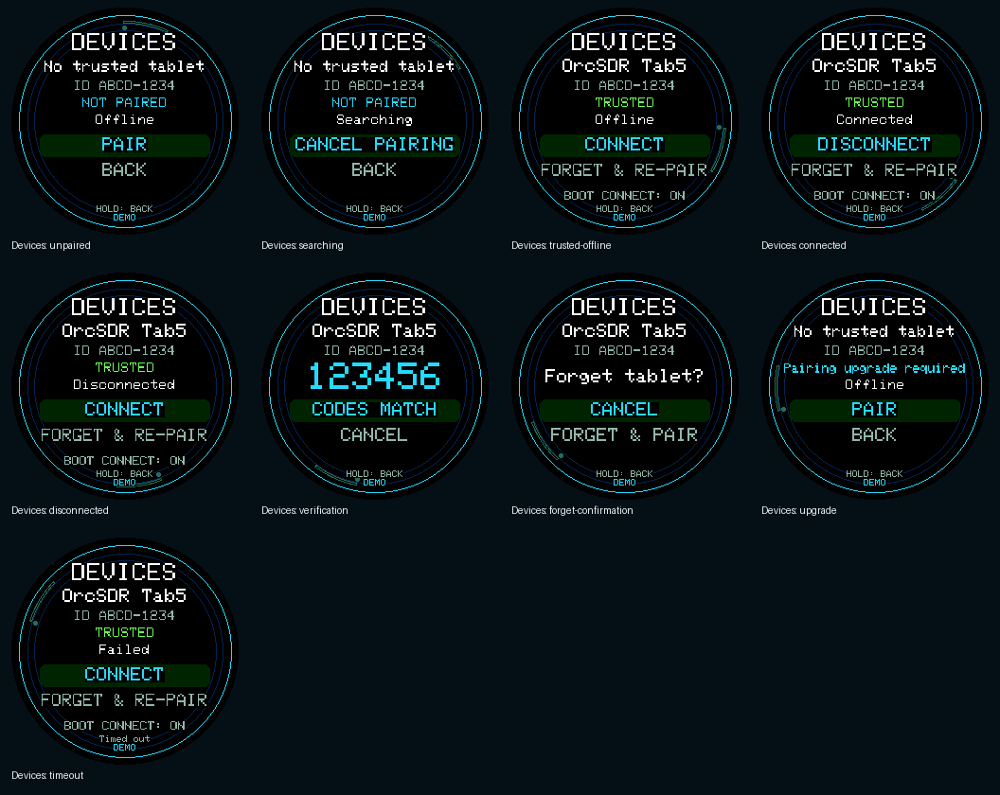

# OrcDial screen gallery

Captured from the M5Dial using the production UI renderer. These are documentation previews, not proof of live RF reception or implementation of every dashboard action. Boot and offline states retain their normal labels; other previews are marked DEMO. Devices trust/connection states are display-only DEMO fixtures, not evidence of live pairing.

Each image is 240 × 240. Transparent corners match the round display; `raw/` preserves unmasked framebuffer captures. The manifest records commands and hashes. Animation is captured as a single frame, not an animation recording.

## Devices

- [Devices: unpaired](devices-unpaired.png)
- [Devices: searching](devices-searching.png)
- [Devices: trusted-offline](devices-trusted-offline.png)
- [Devices: connected](devices-connected.png)
- [Devices: disconnected](devices-disconnected.png)
- [Devices: verification](devices-verification.png)
- [Devices: forget-confirmation](devices-forget-confirmation.png)
- [Devices: upgrade](devices-upgrade.png)
- [Devices: timeout](devices-timeout.png)
